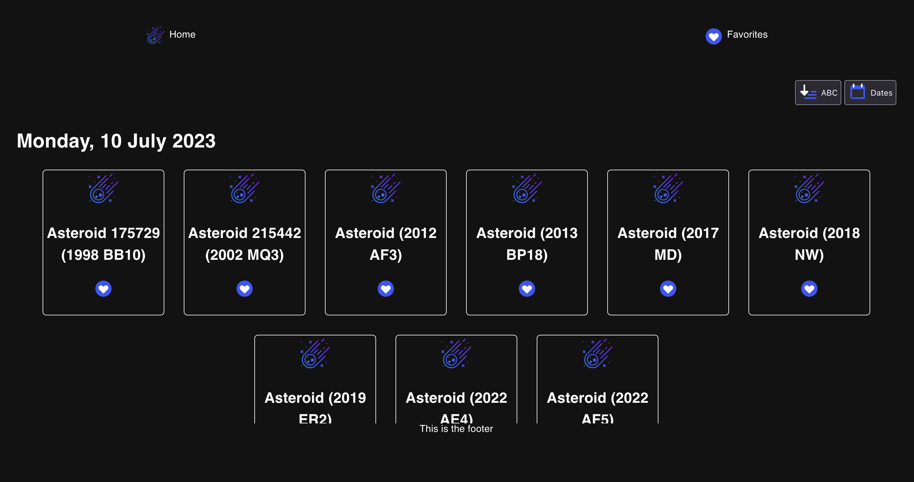

# The Code

## Setup

### Get the Code
git clone
cd
npm install

### DB onfig
rename config.example -> config.json
set your
  DATABASE_USERNAME
  DATABASE_PASSWORD
  DATABASE_NAME
  MYSQL_PORT
  NASA_KEY (if you do not have one, the demo key can handle 50 requests per day, 30 per hour)
add the sql table for the favorites to an existing DB that you set up in the config (just structure)

## Run
npm run dev

# The SQL

[The solution](sql_challenge.md)

